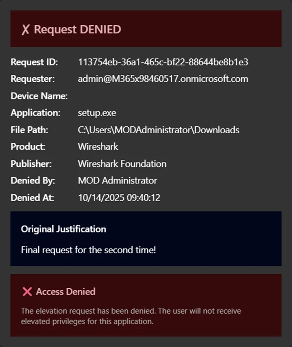

---
categories:
- Microsoft
- Technology
date: '2025-12-12T13:28:42'
status: publish
tags:
- '2025'
- Adaptive Cards
- EPM
- Intune Suite
- Logic Apps
- Teams
title: EPM Automation with Adaptive Cards
seo_title: 'EPM Automation with Adaptive Cards and Logic Apps'
meta_description: 'Build EPM automation with Adaptive Cards in Microsoft Teams. Approve or deny Intune elevation requests directly from Teams using Azure Logic Apps.'
focus_keyphrase: 'EPM automation Adaptive Cards'
---

## Introduction

[This is an update on a previous article.](https://jensdufour.be/2025/08/01/automating-epm-approvals-with-teams-and-azure-logic-apps/)

**EPM automation with Adaptive Cards** transforms how IT teams handle elevation requests in Microsoft Intune. By combining Azure Logic Apps with Teams Adaptive Cards, you can automate the entire Endpoint Privilege Management approval workflow, allowing approvers to act on requests without leaving Microsoft Teams. This EPM automation solution eliminates the need to constantly monitor the Intune portal.


## The Challenge with Manual EPM Approvals

When EPM is configured in Microsoft Intune, end users can request elevation to run applications requiring administrator privileges. However, the traditional approval workflow requires IT administrators to:

1. Navigate to the Intune portal
2. Find the pending elevation request
3. Review the request details
4. Approve or deny the request

This process, while secure, creates friction, especially when approvers are busy with other tasks or aren’t actively monitoring the Intune console.

The result?

Delayed approvals and frustrated users waiting for elevated access.

## How EPM Automation with Adaptive Cards Works

Our EPM automation solution bridges Microsoft Intune and Microsoft Teams by creating an automated workflow that:

* **Polls for pending requests** every 5 minutes using Microsoft Graph API
* **Posts Adaptive Cards** to a designated Teams channel with all request details
* **Enables one-click approval or denial** directly from Teams
* **Updates the Adaptive Card** to show the final decision and who made it



### Architecture for EPM Automation

```
1. Logic App (Recurrence Trigger - every 5 minutes)
        │
        ├──> GET Microsoft Graph API
        │    /deviceManagement/elevationRequests
        │
        ├──> Filter requests with status = "pending"
        │
        ├──> For each pending request:
        │    └──> Post Adaptive Card to Teams channel
        │         ├──> Approve button
        │         └──> Deny button
        │
        └──> When button clicked:
             └──> POST approval/denial via Graph API
             └──> Update Adaptive Card with decision
```

## Key Components of the EPM Automation Solution

### Azure Logic App for EPM Automation

The Logic App serves as the orchestration engine for EPM automation. Using a recurrence trigger, it periodically queries the Microsoft Graph API for pending EPM elevation requests and processes each one by posting an interactive Adaptive Card to Teams.

### Adaptive Cards for Approval Actions

The Adaptive Cards display comprehensive request information:

* **Requester** – Who’s requesting elevation
* **Device Name** – Which device the request originates from
* **Application** – The executable requesting elevation
* **File Path** – Where the application is located
* **Publisher** – The application’s publisher
* **Justification** – Why the user needs elevation

The card includes two action buttons: **Approve** (green) and **Deny** (red). Once clicked, the Adaptive Card updates to reflect the decision.

### Managed Identity for Secure EPM Automation

Security is paramount. Instead of storing credentials or secrets, the EPM automation solution uses an **Azure Managed Identity** to authenticate to Microsoft Graph API. This eliminates secret management overhead and follows security best practices.

### Microsoft Graph API Integration

The solution leverages the Graph API beta endpoint for EPM operations:

* `GET /deviceManagement/elevationRequests` – Retrieve pending requests
* `POST /deviceManagement/elevationRequests/{id}/approve` – Approve a request
* `POST /deviceManagement/elevationRequests/{id}/deny` – Deny a request

## Infrastructure as Code with Bicep

The entire EPM automation solution is defined using **Azure Bicep**, making it reproducible and version-controllable. Here’s a simplified look at the main resources:

```
// Managed Identity for secure Graph API access
resource managedIdentity 'Microsoft.ManagedIdentity/userAssignedIdentities@2023-01-31' = {
  name: '${logicAppName}-identity'
  location: location
  tags: tags
}

// Teams API Connection
resource teamsConnection 'Microsoft.Web/connections@2016-06-01' = {
  name: 'teams-connection'
  location: location
  properties: {
    displayName: 'Teams Connection for EPM Approval'
    api: {
      id: subscriptionResourceId('Microsoft.Web/locations/managedApis', location, 'teams')
    }
  }
}

// Logic App with workflow definition
resource logicApp 'Microsoft.Logic/workflows@2019-05-01' = {
  name: logicAppName
  location: location
  identity: {
    type: 'UserAssigned'
    userAssignedIdentities: {
      '${managedIdentity.id}': {}
    }
  }
  properties: {
    definition: loadJsonContent('workflow.json').definition
    // ... parameters
  }
}
```

## Deploying Your EPM Automation with Adaptive Cards

A PowerShell deployment script automates the entire setup process:

```
# Deploy with default settings
.\deploy.ps1

# Or customize the deployment
.\deploy.ps1 -ResourceGroupName "rg-epm-approval" -Location "westeurope"

# Preview changes first
.\deploy.ps1 -WhatIf
```

The script handles:

* Prerequisites validation (Azure CLI, Bicep, login status)
* Resource group creation
* Bicep template deployment
* Graph API permission assignment via Microsoft Graph PowerShell
* Teams connection authorization prompt

### Required Graph API Permissions

The Managed Identity needs the following application permissions:

| Permission | Purpose |
| --- | --- |
| `DeviceManagementConfiguration.ReadWrite.All` | Read and update EPM elevation requests |
| `DeviceManagementManagedDevices.Read.All` | Read device information |

## Cost of EPM Automation

One of the best aspects of this EPM automation solution is its cost-effectiveness:

| Resource | Estimated Monthly Cost |
| --- | --- |
| Logic App (Consumption) | ~$0.50 |
| Managed Identity | Free |
| Teams API Connection | Free |
| Log Analytics (optional) | ~$2-5 |

**Total: ~$2-6/month** depending on the number of requests processed.

## Security Best Practices

The EPM automation solution follows security best practices:

* **No secrets stored** – Managed Identity handles authentication
* **Least privilege** – Only required Graph permissions are assigned
* **Audit trail** – All decisions are logged in both Intune and Logic App run history
* **Secure outputs** – Sensitive data is protected in Logic App runs

## Extending the EPM Automation Solution

The modular design allows for easy extensions:

* **Email notifications** – Add email alerts for high-priority requests
* **ServiceNow integration** – Create tickets for tracking purposes
* **Conditional logic** – Auto-approve requests from specific applications
* **Escalation workflows** – Escalate unanswered requests after a timeout

## Conclusion

**EPM automation with Adaptive Cards** transforms the approval experience from a portal-centric task into a seamless Teams-based workflow. Approvers can now handle elevation requests without context-switching, leading to faster response times and improved user satisfaction.

The solution is cost-effective (under $10/month), secure (no secrets, managed identity), and easy to deploy (Infrastructure as Code with automated deployment scripts).

Ready to implement EPM automation with Adaptive Cards in your environment? Check out the full source code and detailed deployment instructions on [GitHub](https://github.com/jensdufour/PUB-EPM-Teams-Integration)!