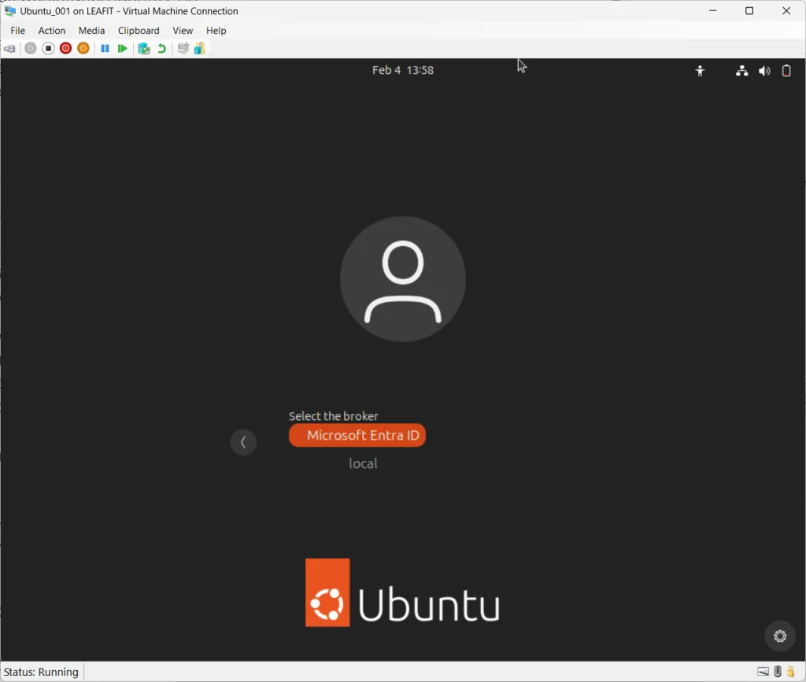
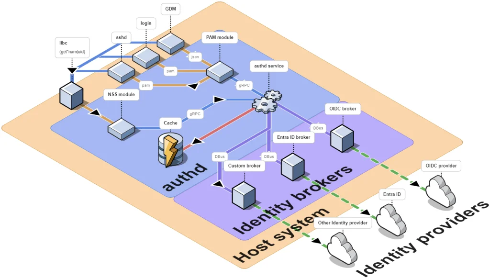
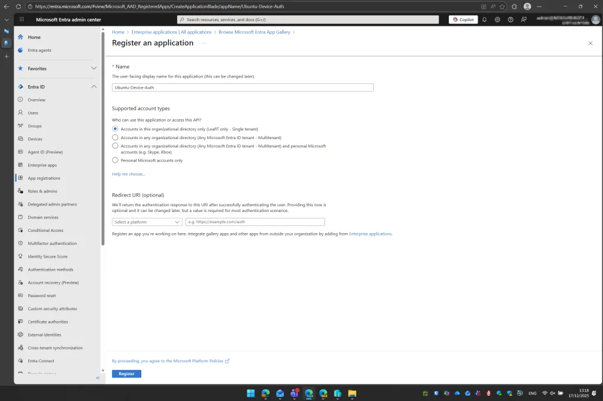
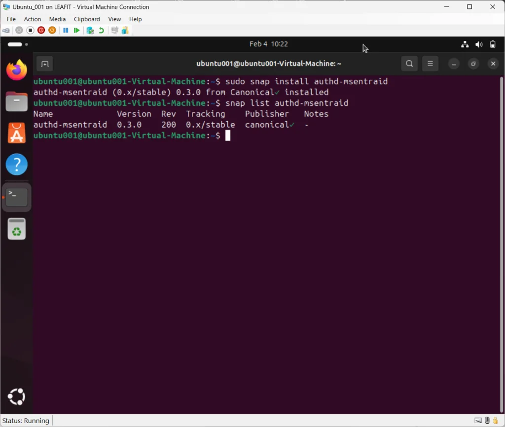
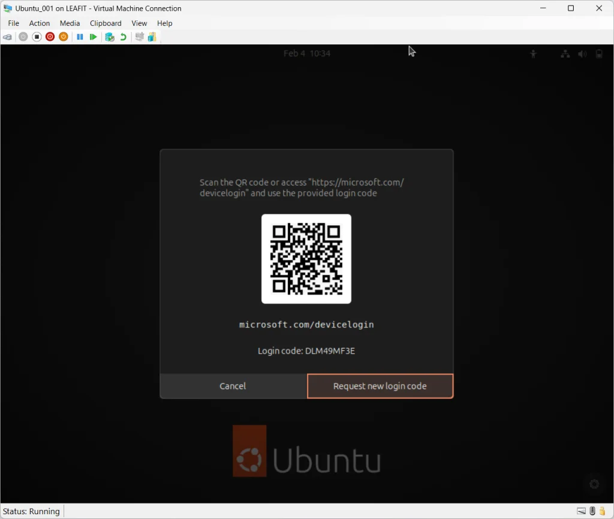

---
categories:
- Linux
- Microsoft
- Technology
date: '2026-02-04T14:05:21'
status: draft
tags:
- Entra ID
- AuthD
- Ubuntu
- Linux
- Authentication
- MFA
- Intune
title: '[Update] Part 1: Entra ID Authentication with AuthD'
seo_title: 'Entra ID Authentication with AuthD on Ubuntu 24.04 LTS'
meta_description: 'Configure Entra ID authentication on Ubuntu 24.04 LTS using AuthD. Covers Azure app registration, MFA support, and offline credential caching.'
focus_keyphrase: 'Entra ID authentication AuthD'
---

## Introduction to Entra ID Authentication

This is an updated version of the [Entra ID authentication on Ubuntu 22.04 LTS](https://jensdufour.be/2024/01/30/entra-id-the-magic-wand-for-ubuntu-23-04-authentication/).

**Entra ID authentication** using AuthD represents a significant shift in how enterprises manage Linux workstation identity. As organizations adopt Ubuntu for development, data science, and productivity workloads, the need for cloud-native authentication becomes critical. AuthD provides the solution, enabling users to log in to Ubuntu with their Microsoft Entra ID credentials.



*Figure 1: Ubuntu 24.04 LTS with GDM showing Microsoft Entra ID login option*

Traditional approaches like LDAP, Kerberos, or SSSD configurations require significant infrastructure and expertise. Furthermore, they complicate the user experience with separate credentials. For organizations invested in Microsoft Entra ID (formerly Azure AD), the question becomes: can we provide the same seamless, secure **Entra ID authentication** experience that users expect on Windows?

The answer is **yes**, thanks to **AuthD** (Ubuntu’s authentication daemon). With AuthD, you can achieve: 3

* **Single Sign-On** with Entra ID credentials on Ubuntu desktops
* **Multi-Factor Authentication (MFA)** using Microsoft Authenticator
* **Device code flow** authentication at the login screen
* **Elimination of local accounts** for enhanced security
* **Offline credential caching** for disconnected scenarios

In this guide, you’ll learn how to:

* Configure Azure app registration for AuthD
* Install and configure AuthD on Ubuntu 24.04 LTS
* Disable local account login while maintaining recovery access
* Troubleshoot common authentication issues

Whether you’re securing a handful of Linux workstations or planning an enterprise-wide rollout, this guide provides everything you need for **Entra ID authentication**.

> **Note:** This guide focuses on AuthD configuration. For device management with Microsoft Intune, see our companion article on [Ubuntu Intune Enrollment](https://file+.vscode-resource.vscode-cdn.net/articles/ubuntu-intune-enrollment).

---

## Understanding Entra ID Authentication Components

Before configuring **Entra ID authentication**, it’s essential to understand the technologies that make this solution work.

### AuthD: The Core of Entra ID Authentication

[AuthD](https://github.com/ubuntu/authd) is Ubuntu’s modern authentication daemon designed specifically for cloud identity providers. Unlike traditional solutions that require domain controllers or complex LDAP configurations, AuthD provides a streamlined approach to cloud authentication.



*Figure 2: AuthD architecture with MS Entra ID broker integration*

**Key Features:**

| Feature | Description |
| --- | --- |
| **Modular Architecture** | Uses “brokers” to interface with different identity providers |
| **Cloud-Native** | Designed for MS Entra ID and Google IAM from the ground up |
| **MFA Support** | Built-in support for device authentication flow |
| **Offline Caching** | Allows cached credentials for offline login |
| **GDM Integration** | Native integration with GNOME Display Manager |
| **SSH Support** | PAM module for SSH authentication |

AuthD consists of two main components:

1. **authd**: The core authentication daemon (Debian package) that handles PAM integration
2. **Identity broker**: A Snap package that interfaces with your identity provider (e.g., `authd-msentraid` for Microsoft Entra ID)

Together, these components enable secure **Entra ID authentication** with minimal configuration overhead.

### Microsoft Entra ID as the Identity Provider

Microsoft Entra ID serves as the identity provider for **Entra ID authentication**. Key capabilities include:

| Capability | Description |
| --- | --- |
| **Centralized Identity** | Single source of truth for user identities |
| **Multi-Factor Authentication** | Device code flow with Microsoft Authenticator |
| **Conditional Access** | Risk-based access decisions (when combined with Intune) |
| **Group-Based Access** | Control who can log into Linux devices |
| **Security Monitoring** | Sign-in logs and risk detection |

### Architecture Overview

The following diagram shows how **Entra ID authentication** works:

```
┌─────────────────────────────────────────────────────────────────────┐
│                         Ubuntu 24.04 LTS                            │
│                                                                     │
│  ┌──────────┐    ┌──────────┐    ┌──────────────────────────────┐   │
│  │   GDM    │───▶│  AuthD   │───▶│  MS Entra ID Broker (Snap)   │   │
│  │ (Login)  │    │ (daemon) │    │  (authd-msentraid)             │   │
│  └──────────┘    └──────────┘    └──────────────────────────────┘   │
│       │               │                      │                      │
│       │               │                      │                      │
│  ┌────▼───────────────▼──────┐               │                      │
│  │      PAM Configuration    │               │                      │
│  │   (Pluggable Auth Module) │               │                      │
│  └───────────────────────────┘               │                      │
│                                              │                      │
└──────────────────────────────────────────────│──────────────────────┘
                                               │
                                               ▼
                         ┌────────────────────────────────────────────┐
                         │           Microsoft Entra ID               │
                         │      (Authentication & Authorization)      │
                         └────────────────────────────────────────────┘
```

The **Entra ID authentication** flow works as follows:

1. First, the user attempts login at GDM (GNOME Display Manager)
2. Then, GDM invokes AuthD through PAM to handle authentication
3. Next, AuthD delegates to the MS Entra ID broker
4. Subsequently, the broker initiates authentication flow with Entra ID
5. Upon success, AuthD creates or updates the local user account
6. Finally, the user is logged in to the desktop

---

## Prerequisites for Entra ID Authentication

Before implementing **Entra ID authentication**, ensure all prerequisites are met.

### Licensing Requirements

| License | Purpose | Required |
| --- | --- | --- |
| **Microsoft Entra ID Free** | Basic authentication | Minimum |
| **Microsoft Entra ID P1** | Conditional Access (with Intune) | Recommended |
| **Microsoft 365 E3/E5** | Includes Entra ID P1 | Alternative |

> **Note:** AuthD itself is free. Licensing requirements depend on features you want to use in Entra ID.

### Technical Prerequisites

**Ubuntu System:**

* Ubuntu Desktop 24.04 LTS (fresh install recommended)
* GNOME desktop environment (included by default)
* amd64 or arm64 architecture
* Network connectivity to Microsoft services
* Local administrator account for initial setup

**Azure Requirements:**

* Global Administrator or Application Administrator role
* Permission to create app registrations in Entra ID

### Network Requirements

Ensure the following endpoints are accessible:

| Endpoint | Purpose |
| --- | --- |
| `login.microsoftonline.com` | Entra ID authentication |
| `graph.microsoft.com` | Microsoft Graph API |
| `microsoft.com/devicelogin` | Device code flow |

### Security Considerations

Before disabling local accounts, plan for:

| Consideration | Recommendation |
| --- | --- |
| **Recovery Access** | Document single-user mode recovery procedure |
| **Break-Glass Account** | Create an emergency admin account in Entra ID |
| **Disk Encryption** | Use LUKS, store recovery key securely |
| **Network Dependency** | Plan for offline login scenarios (cached credentials) |
| **Rollback Plan** | Keep local admin access until fully validated |


---

## Azure Configuration for Entra ID Authentication

To enable **Entra ID authentication**, you must first create an app registration in Azure.



*Figure 3: Azure Portal showing app registration configuration for AuthD*

### Step 1: Create App Registration

1. **Navigate to Azure Portal**
   * Go to [portal.azure.com](https://portal.azure.com/)
   * Select **Microsoft Entra ID** > **App registrations** > **New registration**
2. **Register the Application**
   * **Name:** `Ubuntu-Device-Auth`
   * **Supported account types**: Accounts in this organizational directory only
   * **Redirect URI:** Leave blank
3. **Click Register**

### Step 2: Configure API Permissions

Add the required Microsoft Graph permissions:

1. Navigate to **API permissions** > **Add a permission**
2. Select **Microsoft Graph** > **Delegated permissions**
3. Add the following permissions:
   * `User.Read`: Read user profile
   * `offline_access`: Refresh tokens for offline access
   * `openid`: OpenID Connect authentication
   * `profile:` Read user profile information
4. Click **Grant admin consent** for your organization

### Step 3: Enable Public Client Flow

Device code flow requires public client settings:

1. Navigate to **Authentication**
2. Under **Settings**, set **Allow public client flows** to **Enabled**
3. Click **Save**

### Step 4: Record Application Details

Note down these values for later configuration:

| Value | Location |
| --- | --- |
| **Application (client) ID** | Overview page |
| **Directory (tenant) ID** | Overview page |


---

## Ubuntu Configuration: Installing AuthD

With Entra ID configured, you can now install and configure AuthD to enable **Entra ID authentication**.

### Step 1: Update System

Start with a fresh system update:

```
# Update package lists
sudo apt update
sudo apt upgrade -y
```

### Step 2: Add AuthD PPA

AuthD is available from the Ubuntu Enterprise Desktop PPA:

```
# Add the AuthD PPA
sudo add-apt-repository -y ppa:ubuntu-enterprise-desktop/authd

# Update package list
sudo apt update
```

### Step 3: Install AuthD

Install AuthD with GNOME integration:

```
# Install AuthD
sudo apt install -y authd
```

### Step 4: Install MS Entra ID Broker

The broker is distributed as a Snap package:

```
# Install the MS Entra ID broker
sudo snap install authd-msentraid

# Verify installation
snap list authd-msentraid
```



*Figure 4: Installing AuthD and MS Entra broker on Ubuntu*

---

## Configuring AuthD for Entra ID Authentication

After installation, configure AuthD with your Azure app registration details.

### Step 1: Create Broker Configuration Directory

```
# Create broker directory (required by AuthD)
sudo mkdir -p /etc/authd/brokers.d
sudo chmod 700 /etc/authd/brokers.d

# Copy broker declaration from the snap package
sudo cp /snap/authd-msentraid/current/conf/authd/msentraid.conf /etc/authd/brokers.d/
sudo chmod 600 /etc/authd/brokers.d/msentraid.conf

# Edit the real broker config (tenant + client ID)
sudo nano /var/snap/authd-msentraid/current/broker.conf
sudo chmod 600 /var/snap/authd-msentraid/current/broker.conf
sudo chmod 700 /var/snap/authd-msentraid/current

# Restart services
sudo systemctl restart authd
sudo snap restart authd-msentraid
```

### Step 2: Configure the Broker

Edit the broker configuration with your Azure details:

```
# Edit broker configuration
sudo nano /var/snap/authd-msentraid/current/broker.conf
```

Add or modify the following configuration:

```
[oidc]
issuer = https://login.microsoftonline.com/<YOUR_TENANT_ID>/v2.0
client_id = <YOUR_CLIENT_ID>

[users]
# Allow all authenticated users
allowed_users = ALL
# Entra ID password becomes the local Linux password
password_passthrough = true


# Or restrict to specific users:
# allowed_users = user1@yourdomain.com

# Or use OWNER mode (first user becomes owner):
# allowed_users = OWNER
```

Replace:

* `<YOUR_TENANT_ID>` with your Microsoft Entra tenant ID
* `<YOUR_CLIENT_ID>` with your app registration client ID

### User Access Options

| Setting | Description |
| --- | --- |
| `ALL` | Any authenticated Entra ID user can log in |
| `OWNER` | First user to authenticate becomes the owner |
| `user@domain.com` | Comma-separated list of allowed users |

### Step 3: Configure Login Timeout

The default login timeout may be too short for MFA. Increase it:

```
# Edit login.defs
sudo nano /etc/login.defs

# Find LOGIN_TIMEOUT and modify (or add if not present)
LOGIN_TIMEOUT 120
```

### Step 4: Restart Services

Apply the configuration:

```
# Restart AuthD service
sudo systemctl restart authd

# Restart the broker
sudo snap restart authd-msentraid

# Verify services are running
systemctl status authd
snap services authd-msentraid
```

### Step 5: Test Authentication

Before making further changes, verify **Entra ID authentication** works:

1. **Log out** of your current session
2. Click **“Microsoft Entra ID”** to select it as the broker (or similar option)
3. Enter your organizational email
4. Complete the device code authentication flow:
   * Open <https://microsoft.com/devicelogin> on another device
   * Enter the code displayed on the Ubuntu screen
   * Complete MFA authentication
5. You should be logged in with your Entra ID account



*Figure 5: The device code authentication flow*

---

## Disabling Local Accounts for Secure Entra ID Authentication

> **Warning:** Only proceed after successfully testing **Entra ID authentication**. Ensure you have recovery access planned.

### Understanding the Security Implications

Disabling local account login enhances security:

| Benefit | Description |
| --- | --- |
| **No local password attacks** | Eliminates brute-force risks |
| **Centralized authentication** | All authentication flows through Entra ID |
| **MFA enforcement** | Every login requires multi-factor authentication |
| **Audit trail** | All logins logged in Entra ID |

However, you must plan for:

* Network connectivity requirements (first login requires network)
* Recovery procedures (boot-level or break-glass access)
* Cached credential limitations

### Method 1: Lock Local User Accounts

The safest approach preserves accounts for emergency recovery:

```
# List local users (UID >= 1000, excluding nobody)
awk -F: '$3 >= 1000 && $1 != "nobody" {print $1}' /etc/passwd

# Lock each local user account (example for user 'localadmin')
sudo passwd -l localadmin

# Remove from sudo group if not needed
sudo deluser localadmin sudo
```

To unlock in emergency:

```
sudo passwd -u localadmin
```

### Method 2: PAM Configuration for AuthD Priority

Configure PAM to prioritize AuthD:

```
# Backup existing PAM configuration
sudo cp /etc/pam.d/common-auth /etc/pam.d/common-auth.backup

# Edit PAM configuration
sudo nano /etc/pam.d/common-auth
```

Modify to prioritize AuthD:

```
# AuthD authentication (primary)
auth    [success=2 default=ignore]    pam_authd.so

# Local authentication (fallback - comment out to disable)
# auth   [success=1 default=ignore]    pam_unix.so nullok_secure

# Deny if all methods fail
auth    requisite                       pam_deny.so
auth    required                        pam_permit.so
```

### Method 3: Hide Local Users from GDM

Hide local users from the login screen:

```
# Create/edit GDM configuration
sudo nano /etc/gdm3/greeter.dconf-defaults

# Add the following
[org/gnome/login-screen]
disable-user-list=true
```

Apply changes:

```
sudo dpkg-reconfigure gdm3
```

### Recovery Access Setup

Always maintain emergency access:

1. **Recovery Mode Access**
   * To access single-user mode:
     + Reboot and hold SHIFT to access GRUB
     + Edit boot entry, add ‘single’ to kernel parameters
     + Boot into single-user mode (requires disk encryption password)
2. **Break-Glass Admin Account**
   * Create a dedicated admin account in Entra ID
   * Add to `allowed_users` in broker configuration
   * Store credentials securely (password manager)
   * Document when and how to use
3. **Create Recovery Script**

```
sudo tee /root/emergency-recovery.sh > /dev/null << 'EOF' 
#!/bin/bash 
# Emergency recovery script - Run from recovery mode 
mount -o remount,rw / passwd -u localadmin 
cp /etc/pam.d/common-auth.backup /etc/pam.d/common-auth 
echo "Recovery complete. Reboot normally." 
EOF 
sudo chmod 700 /root/emergency-recovery.sh
```

---

## Automation Script for Entra ID Authentication

For consistent deployments, use this automation script for **Entra ID authentication**:

```
#!/bin/bash
#===============================================================================
# Script Name: setup-authd.sh
# Description: Automated setup of AuthD on Ubuntu 24.04 LTS
# Author: Enterprise IT
# Version: 1.0
#===============================================================================

set -e  # Exit on error

# Configuration Variables - MODIFY THESE
TENANT_ID="YOUR_TENANT_ID_HERE"
CLIENT_ID="YOUR_CLIENT_ID_HERE"
ALLOWED_USERS="ALL"  # Options: ALL, OWNER, or comma-separated emails
DISABLE_LOCAL_LOGIN="false"  # Set to "true" to disable local login

# Logging
LOG_FILE="/var/log/authd-setup.log"
exec 1> >(tee -a "$LOG_FILE") 2>&1

log() {
    echo "[$(date '+%Y-%m-%d %H:%M:%S')] $1"
}

error() {
    echo "[$(date '+%Y-%m-%d %H:%M:%S')] ERROR: $1" >&2
    exit 1
}

# Check if running as root
if [[ $EUID -ne 0 ]]; then
    error "This script must be run as root (use sudo)"
fi

# Validate configuration
if [[ "$TENANT_ID" == "YOUR_TENANT_ID_HERE" ]]; then
    error "Please set TENANT_ID before running this script"
fi

if [[ "$CLIENT_ID" == "YOUR_CLIENT_ID_HERE" ]]; then
    error "Please set CLIENT_ID before running this script"
fi

# Check Ubuntu version
if ! grep -q "24.04" /etc/lsb-release; then
    error "This script is designed for Ubuntu 24.04 LTS"
fi

log "Starting AuthD setup..."

#===============================================================================
# PHASE 1: Install AuthD
#===============================================================================

log "Phase 1: Installing AuthD..."

apt update

# Add AuthD PPA
if ! grep -q "ubuntu-enterprise-desktop/authd" /etc/apt/sources.list.d/*.list 2>/dev/null; then
    add-apt-repository -y ppa:ubuntu-enterprise-desktop/authd
    log "AuthD PPA added"
fi

apt update
apt install -y authd

log "AuthD installed"

#===============================================================================
# PHASE 2: Install MS Entra ID Broker
#===============================================================================

log "Phase 2: Installing MS Entra ID broker..."

snap install authd-msentraid

log "MS Entra ID broker installed"

#===============================================================================
# PHASE 3: Configure Broker
#===============================================================================

log "Phase 3: Configuring broker..."

# Create broker configuration directory
mkdir -p /etc/authd/brokers.d/

# Copy broker declaration
cp /snap/authd-msentraid/current/conf/authd/msentraid.conf /etc/authd/brokers.d/

# Configure broker
cat > /var/snap/authd-msentraid/current/broker.conf << EOF
[oidc]
issuer = https://login.microsoftonline.com/${TENANT_ID}/v2.0
client_id = ${CLIENT_ID}

[users]
allowed_users = ${ALLOWED_USERS}
password_passthrough = true
EOF

log "Broker configured"

#===============================================================================
# PHASE 4: Configure Login Timeout
#===============================================================================

log "Phase 4: Configuring login timeout..."

if grep -q "^LOGIN_TIMEOUT" /etc/login.defs; then
    sed -i 's/^LOGIN_TIMEOUT.*/LOGIN_TIMEOUT 120/' /etc/login.defs
else
    echo "LOGIN_TIMEOUT 120" >> /etc/login.defs
fi

log "Login timeout configured"

#===============================================================================
# PHASE 5: Disable Local Login (Optional)
#===============================================================================

if [ "$DISABLE_LOCAL_LOGIN" = "true" ]; then
    log "Phase 5: Disabling local login..."
    
    # Backup PAM configuration
    cp /etc/pam.d/common-auth /etc/pam.d/common-auth.backup.$(date +%Y%m%d)
    
    # Hide user list in GDM
    mkdir -p /etc/gdm3
    cat >> /etc/gdm3/greeter.dconf-defaults << 'EOF'

[org/gnome/login-screen]
disable-user-list=true
EOF

    # Lock local accounts
    for user in $(awk -F: '$3 >= 1000 && $1 != "nobody" {print $1}' /etc/passwd); do
        passwd -l "$user" 2>/dev/null || true
        log "Locked local user: $user"
    done
    
    log "Local login disabled"
else
    log "Phase 5: Skipping local login disable (set DISABLE_LOCAL_LOGIN=true to enable)"
fi

#===============================================================================
# PHASE 6: Restart Services
#===============================================================================

log "Phase 6: Restarting services..."

systemctl restart authd
snap restart authd-msentraid

log "Services restarted"

#===============================================================================
# COMPLETION
#===============================================================================

log "=============================================="
log "Setup completed successfully!"
log "=============================================="
log ""
log "Next steps:"
log "1. Reboot the system"
log "2. Log out and test Entra ID authentication at GDM"
log ""
log "Configuration details:"
log "  - Tenant ID: ${TENANT_ID}"
log "  - Client ID: ${CLIENT_ID}"
log "  - Allowed Users: ${ALLOWED_USERS}"
log "  - Local Login Disabled: ${DISABLE_LOCAL_LOGIN}"
log ""
log "Log file: ${LOG_FILE}"

echo ""
echo "Reboot now? (y/n)"
read -r response
if [[ "$response" =~ ^[Yy]$ ]]; then
    reboot
fi
```

### Using the Automation Script

1. **Save the script** as `setup-authd.sh`
2. **Edit configuration variables**:
   * TENANT\_ID=”your-tenant-id”
   * CLIENT\_ID=”your-client-id”
   * ALLOWED\_USERS=”ALL”
   * DISABLE\_LOCAL\_LOGIN=”false”
3. **Run the script**:
   * `chmod +x setup-authd.sh sudo ./setup-authd.sh`
4. **Complete post-script steps**:
   * Reboot the system
   * Test Entra ID authentication
   * If successful, re-run with:
     + `DISABLE_LOCAL_LOGIN="true"`

---

## Troubleshooting Entra ID Authentication Issues

When implementing **Entra ID authentication**, you may encounter various issues.

### AuthD Authentication Failures

| Issue | Cause | Solution |
| --- | --- | --- |
| No Entra ID option at GDM | Broker not configured | Check `/etc/authd/brokers.d/msentraid.conf` exists |
| “Authentication failed” | Wrong client ID | Verify client ID in broker.conf |
| Device code timeout | LOGIN\_TIMEOUT too short | Increase in `/etc/login.defs` |
| User not allowed | allowed\_users restriction | Update broker.conf allowed\_users |
| “Invalid issuer” | Wrong tenant ID | Verify tenant ID in broker.conf |

### Login Issues After Configuration

| Issue | Cause | Solution |
| --- | --- | --- |
| Can’t log in at all | PAM misconfigured | Boot to recovery mode, restore PAM backup |
| Slow login | Network latency | Check DNS, consider cached credentials |
| MFA not working | Device code flow issue | Verify app registration settings |
| Home directory not created | NSS issue | Check `/etc/nsswitch.conf` includes authd |

### Useful Troubleshooting Commands

```
# Check AuthD service status
systemctl status authd

# View AuthD logs
journalctl -u authd -f

# Check broker logs
snap logs authd-msentraid

# View broker configuration
cat /var/snap/authd-msentraid/current/broker.conf

# Test authentication manually
authd-cli authenticate
```

### Recovery Commands

If locked out, boot to recovery mode:

```
# Mount filesystem read-write
mount -o remount,rw /

# Restore PAM configuration
cp /etc/pam.d/common-auth.backup /etc/pam.d/common-auth

# Unlock local user
passwd -u localadmin

# Restart services
systemctl restart authd
```

---

## Best Practices for Entra ID Authentication

To ensure your **Entra ID authentication** deployment is secure and reliable, follow these best practices.

### Security Hardening

| Practice | Description |
| --- | --- |
| **Enable disk encryption** | Use LUKS during Ubuntu installation |
| **Configure automatic updates** | Enable unattended-upgrades for security patches |
| **Monitor login attempts** | Review Entra ID sign-in logs regularly |
| **Restrict allowed users** | Only allow users who need Linux access |
| **Document recovery procedures** | Test recovery quarterly |

### Operational Best Practices

1. **Document Recovery Procedures**
   * Create step-by-step recovery documentation
   * Store recovery keys securely (not on the device)
   * Test recovery procedures quarterly
2. **Plan for Offline Scenarios**
   * AuthD caches credentials for offline login
   * First login always requires network
   * Document offline limitations for users
3. **User Communication**
   * Provide training on device code authentication
   * Create FAQ for common issues
   * Establish support channels
4. **Staged Rollout**
   * Pilot with IT team first
   * Expand to early adopters
   * Full deployment after validation

### Monitoring Commands

```
# Check AuthD service status
systemctl status authd

# View AuthD logs
journalctl -u authd -f

# Check broker logs
snap logs authd-msentraid

# List logged-in users
who
```

---

## Conclusion: Embracing Entra ID Authentication

Implementing **Entra ID authentication** with AuthD transforms Ubuntu workstations into cloud-native enterprise systems. As a result, organizations achieve:

* **Eliminate password sprawl** with single sign-on
* **Enhance security** through MFA enforcement
* **Simplify management** with centralized identity
* **Reduce attack surface** by eliminating local accounts
* **Enable unified identity** across all platforms

This **Entra ID authentication** solution represents the future of enterprise Linux management. As AuthD continues to evolve (with plans for inclusion in Ubuntu 26.04 LTS), expect even deeper integration and additional identity provider support.

**Ready to implement Entra ID authentication?** Begin with a single test workstation, validate the authentication flow, then scale your deployment with confidence.

---

## Additional Resources

### External Documentation

* [AuthD Official Documentation](https://documentation.ubuntu.com/authd/stable-docs/)
* [AuthD GitHub Repository](https://github.com/ubuntu/authd)
* [Microsoft Entra ID Documentation](https://learn.microsoft.com/en-us/entra/)

---

*Have questions about implementing **Entra ID authentication**? Share your experience in the comments below or reach out for assistance!*