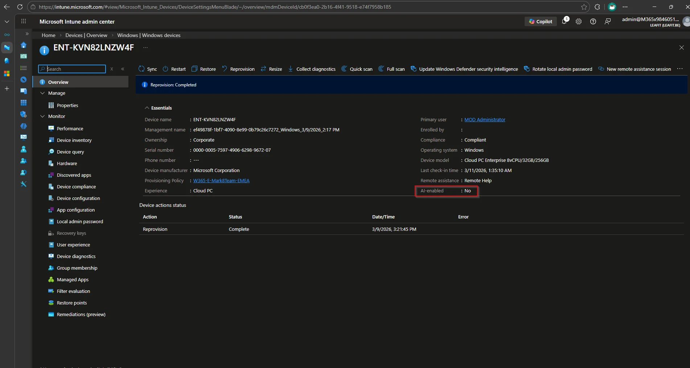
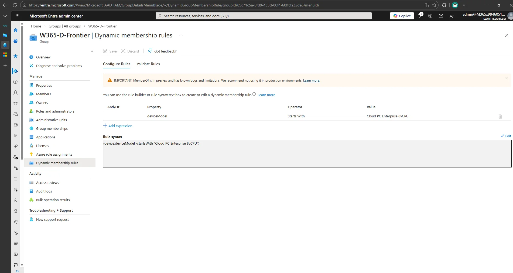
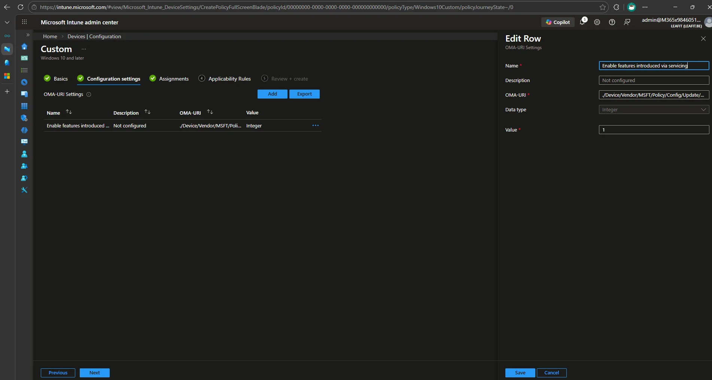
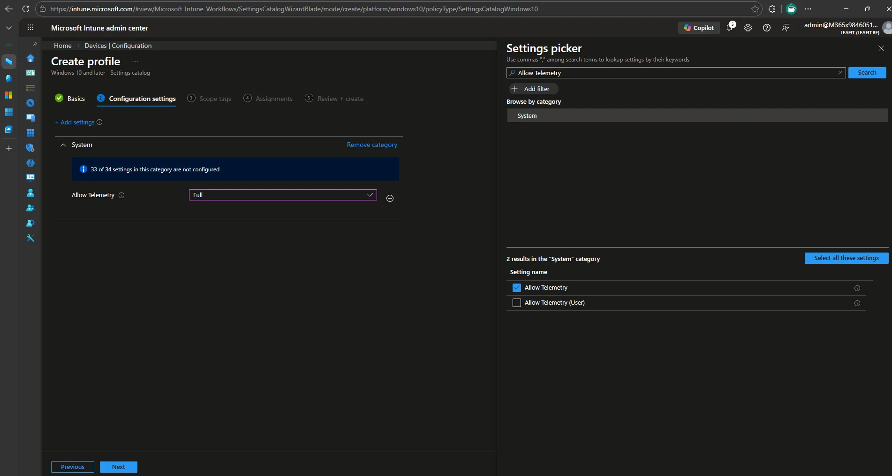
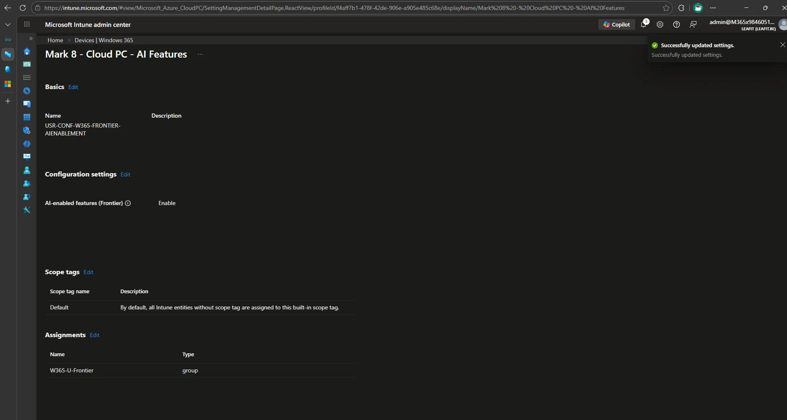

Copilot+ PC features like improved Windows Search and Click to Do are no longer limited to devices with a physical NPU. Through the **Frontier Preview**, Microsoft now lets you light up these AI capabilities on Windows 365 Enterprise Cloud PCs with 8 vCPUs. In this post we will walk through every Intune configuration step needed to enable them at scale, from dynamic group creation all the way to validation.

> **Note:** The Frontier Preview is a public preview. Future availability depends on its results and is subject to change.

## Prerequisites at a Glance

Before diving into the configuration, make sure you have the following in place:

| Requirement | Detail |
|---|---|
| **SKU** | Windows 365 Enterprise, minimum **8 vCPU / 32 GB RAM / 256 GB disk** |
| **Region** | West Europe, North Europe, UK South, East US, East US 2, Central US, West US 2, West US 3, Central India, South East Asia, or Australia East |
| **OS build** | Windows 24H2 (>= 26100.6584) or 25H2 (>= 26200.6584) |
| **Windows Insider** | Users must be registered with the Windows Insider Program |
| **Licensing** | A Windows 365 Enterprise license assigned to the target users |

With these in place, let's start configuring.

## Step 1: Create Dynamic Entra ID Groups

To target the right Cloud PCs and users, we will create two dynamic groups in Entra ID. This ensures that any future 8 vCPU Cloud PCs and their users are automatically included.

### W365-U-Frontier (Dynamic user group)

This group automatically contains all users that have a Windows 365 Enterprise 8 vCPU license assigned.

1. Navigate to **Microsoft Entra admin center** > **Groups** > **All groups** > **New group**.
2. Set the **Group type** to **Security**.
3. Set the **Group name** to `W365-U-Frontier`.
4. Set **Membership type** to **Dynamic User**.
5. Click **Add dynamic query** and enter the following rule:

```
(user.assignedPlans -any (assignedPlan.servicePlanId -eq "69dc175c-dcff-4757-8389-d19e76acb45d" -and assignedPlan.capabilityStatus -eq "Enabled"))
```

The service plan ID `69dc175c-dcff-4757-8389-d19e76acb45d` corresponds to the `CPC_E_8C_32GB_256GB` SKU (Windows 365 Enterprise 8 vCPU, 32 GB, 256 GB).



6. Click **Save** and then **Create**.

### W365-D-Frontier (Dynamic device group)

This group automatically contains all Cloud PC devices that match the 8 vCPU configuration. The `deviceModel` property in Entra ID follows the format `Cloud PC Enterprise 8vCPU/<RAM>/<disk>`, so we use a `-startsWith` operator to capture all variants (128 GB, 256 GB, 512 GB).

1. Navigate to **Microsoft Entra admin center** > **Groups** > **All groups** > **New group**.
2. Set the **Group type** to **Security**.
3. Set the **Group name** to `W365-D-Frontier`.
4. Set **Membership type** to **Dynamic Device**.
5. Click **Add dynamic query** and enter the following rule:

```
(device.deviceModel -startsWith "Cloud PC Enterprise 8vCPU")
```


6. Click **Save** and then **Create**.

> **Tip:** Give the dynamic membership rules a few minutes to evaluate. You can check the membership under **Groups** > **W365-D-Frontier** > **Members** to confirm devices are populating.

## Step 2: Configure the PowerShell Execution Policy

AI-enabled features require the **RemoteSigned** execution policy on the Cloud PC. Instead of configuring this manually on each device, deploy it through Intune.

1. Navigate to **Microsoft Intune admin center** > **Devices** > **Configuration** > **Create** > **New Policy**.
2. Select **Windows 10 and later** as the platform and **Settings catalog** as the profile type.
3. Name the policy `DEV-CONF-W365-FRONTIER-EXECUTIONPOLICY`.
4. Click **Add settings** and search for `PowerShell`.
5. Select **Administrative Templates > Windows Components > Windows PowerShell** and enable **Turn on Script Execution**.
6. Set **Execution Policy** to **Allow only signed scripts** (this is the RemoteSigned equivalent).



7. On the **Assignments** tab, assign to the **W365-D-Frontier** device group.
8. Click **Create**.

## Step 3: Enable Features Introduced via Servicing

A Windows Update policy must be enabled so that features delivered through servicing updates are activated. This setting is not available in the Settings Catalog, so we deploy it as a custom configuration profile using OMA-URI.

1. Navigate to **Microsoft Intune admin center** > **Devices** > **Configuration** > **Create** > **New Policy**.
2. Select **Windows 10 and later** as the platform and **Templates** as the profile type, then select **Custom**.
3. Name the policy `DEV-CONF-W365-FRONTIER-SERVICING`.
4. Click **Add** under **OMA-URI Settings** and configure the following:

| Field | Value |
|---|---|
| **Name** | Enable features introduced via servicing |
| **OMA-URI** | `./Device/Vendor/MSFT/Policy/Config/Update/AllowTemporaryEnterpriseFeatureControl` |
| **Data type** | Integer |
| **Value** | `1` |



5. Click **Save**, then **Next**.
6. On the **Assignments** tab, assign to the **W365-D-Frontier** device group.
7. Click **Create**.

## Step 4: Enable Optional Diagnostics Data

The Windows Insider Program requires optional diagnostics data to be enabled on Cloud PCs. Without it, the device will display "To join the Insider program, turn on optional diagnostics data" and cannot enroll in the Beta channel. Deploy this through a Settings Catalog policy.

1. Navigate to **Microsoft Intune admin center** > **Devices** > **Configuration** > **Create** > **New Policy**.
2. Select **Windows 10 and later** as the platform and **Settings catalog** as the profile type.
3. Name the policy `DEV-CONF-W365-FRONTIER-DIAGNOSTICS`.
4. Click **Add settings** and search for `Allow Telemetry`.
5. Select **System > Allow Telemetry** and set it to **Full** (this enables optional diagnostics data).



6. On the **Assignments** tab, assign to the **W365-D-Frontier** device group.
7. Click **Create**.

## Step 5: Enroll Cloud PCs in the Windows Insider Beta Channel

The AI features require the Windows Insider Beta channel. Instead of having each user manually opt in, use an Intune Update Ring to handle this at scale.

1. Navigate to **Microsoft Intune admin center** > **Devices** > **Windows updates** > **Update rings**.
2. Click **+ Create profile**.
3. Name it `DEV-CONF-W365-FRONTIER-INSIDERBETA`.
4. Under **Update ring settings**:
   - Set **Enable pre-release builds** to **Enable**.
   - Set **Select pre-release channel** to **Beta Channel**.
5. Leave the remaining settings at their defaults.



6. On the **Assignments** tab, assign to the **W365-D-Frontier** device group.
7. Click **Create**.

After the policy syncs, Cloud PCs will start receiving Beta channel updates. Make sure devices check for updates and restart.

## Step 6: Assign AI-Enablement in Intune

With all prerequisites deployed, you can now flip the switch to enable AI features on the targeted Cloud PCs.

1. Navigate to **Microsoft Intune admin center** > **Devices** > **Device onboarding** > **Windows 365**.
2. Select the **Settings** tab.
3. Click **Create** and select **Cloud PC configurations**.
4. Enter a **Name**, for example `USR-CONF-W365-FRONTIER-AIENABLEMENT`.
5. On the **Configuration settings** tab, set **AI-enabled features** to **Enable**.


6. On the **Assignments** tab, assign to the **W365-U-Frontier** user group.
7. Proceed to **Review + create** and click **Create**.

> **Important:** After AI-enablement is assigned, it can take **up to 48 hours** for the background processes to complete. During this time, the Cloud PCs are setting up the AI infrastructure locally.

## Step 7: Apply Updates and Restart

Once the 48-hour enablement window has passed, updates need to be applied:

1. On the Cloud PC, open **Settings** > **Windows Update**.
2. Click **Check for updates**, install any pending updates, and **restart**.
3. **Repeat** this process 3-5 times until no more updates are pending.

This can also be managed at scale using Intune's **Windows Update for Business** policies or by using **Expedite updates** to push things along.

## Step 8: Validate the Deployment

After the updates have been applied, you can verify that AI features are active in several places.

### Intune Admin Validation

**Device Overview page:**
Navigate to **Devices** > select a Cloud PC > **Overview**. The **Essentials** tab will show an **AI-enabled** field.

<!-- TODO: Add screenshot of device overview AI-enabled field -->

**Reports dashboard:**
Navigate to **Reports** > **Windows 365** > **Cloud PC overview**. You will see a breakdown of AI-enabled Cloud PCs by status:

- **Initiated** - AI enablement is in progress
- **Ready to use** - Features are available
- **Failed** - Setup could not complete

<!-- TODO: Add screenshot of reports dashboard -->

### End-User Validation

**Windows App:**
AI-enabled Cloud PCs show an **"AI-enabled"** tag on the device card within the Windows App.

<!-- TODO: Add screenshot of Windows App AI-enabled tag -->

**Windows Taskbar:**
The search box on the taskbar displays a **magnifying glass with sparkles** icon when AI features are active.

<!-- TODO: Add screenshot of taskbar sparkles icon -->

> **Note:** After a Windows Update, the sparkles icon might temporarily disappear. If clicking the search box doesn't restore it, check the [AI-enabled Cloud PC Known Issues](https://learn.microsoft.com/en-us/troubleshoot/windows-365/windows-365-ai-enabled-cloud-pc-known-issues) page.

## What You Get: Supported Features

Once everything is set up, your Cloud PCs get access to the following Copilot+ features:

### Improved Windows Search

Users can find files using **descriptive, natural-language queries**. The AI interprets intent and searches across local files and OneDrive. For example, searching "airplane" will surface a photo named `Picture26.jpg` that contains an airplane.

This works in both the **Windows Search box** on the taskbar and in **File Explorer**. It supports English, Chinese (Simplified), French, German, Japanese, and Spanish.

<!-- TODO: Add screenshot of improved Windows Search -->

### Click to Do

Press **Win + Q** or hold the **Windows key** while left-clicking an element on screen to get contextual actions on highlighted text or images. You can summarize text, look up information, or perform actions on images without switching apps.

<!-- TODO: Add screenshot of Click to Do -->

> **Note:** You must launch the Click to Do app once after AI-enablement and after every Cloud PC restart before the keyboard shortcuts work. Some intelligent text actions (like "Ask Microsoft 365 Copilot") are not yet supported on Cloud PCs.

## Managing and Removing AI Features

### Granular Feature Control

If you want to keep AI-enablement but toggle individual features:

- **Click to Do**: Manage through [Click to Do client management policies](https://learn.microsoft.com/en-us/windows/client-management/manage-click-to-do).
- **Improved Windows Search**: Use the [Search Policy CSP](https://learn.microsoft.com/en-us/windows/client-management/mdm/policy-csp-search) settings in Intune.

### Disabling AI-Enablement Entirely

There are two options:

1. **Unassign** the user from the Enable policy.
2. **Create a Disable policy**: Follow the same steps as Step 6, but set **AI-enabled features** to **Disable** and assign to the target group. The Disable policy takes precedence over Enable during conflict resolution.

After disabling, it can take up to 48 hours for the AI features to be removed from the Cloud PCs.

## Privacy and Security

AI-enabled Cloud PCs follow the same [Windows 365 privacy and data policies](https://learn.microsoft.com/en-us/windows-365/enterprise/privacy-personal-data):

- **Processing**: AI features process data **ephemerally** using a secure Windows 365 cloud service. No personal or user data is stored in the cloud service or used for AI model training.
- **Storage**: All data and indexes are stored **locally on the Cloud PC**. This is unchanged from existing Windows AI features.
- **Controls**: AI features are **off by default**. The IT admin must explicitly enable them through the configuration steps described above.

## Conclusion

With a few Intune policies and a couple of dynamic Entra ID groups, you can bring Copilot+ AI features to your Windows 365 8 vCPU fleet without touching a single Cloud PC. The key steps are:

1. Create dynamic groups to target the right users and devices.
2. Deploy execution policy and servicing feature policies.
3. Enable optional diagnostics data for Windows Insider enrollment.
4. Enroll devices in the Windows Insider Beta channel.
5. Enable AI features through a Cloud PC configuration.
6. Apply updates and validate.

For troubleshooting, check the [AI-enabled Cloud PC Known Issues](https://learn.microsoft.com/en-us/troubleshoot/windows-365/windows-365-ai-enabled-cloud-pc-known-issues) page. For the full Microsoft documentation, see [AI-enabled Cloud PC (Frontier Preview)](https://learn.microsoft.com/en-us/windows-365/enterprise/ai-enabled-cloud-pcs) and [Manage AI-enabled features](https://learn.microsoft.com/en-us/windows-365/enterprise/manage-ai-enabled-features).

## Sources

- [AI-enabled Cloud PC (Frontier Preview)](https://learn.microsoft.com/en-us/windows-365/enterprise/ai-enabled-cloud-pcs)
- [Manage AI-enabled features on Cloud PCs](https://learn.microsoft.com/en-us/windows-365/enterprise/manage-ai-enabled-features)
- [AI-enabled Cloud PC Known Issues](https://learn.microsoft.com/en-us/troubleshoot/windows-365/windows-365-ai-enabled-cloud-pc-known-issues)
- [Product names and service plan identifiers for licensing](https://learn.microsoft.com/en-us/entra/identity/users/licensing-service-plan-reference)
