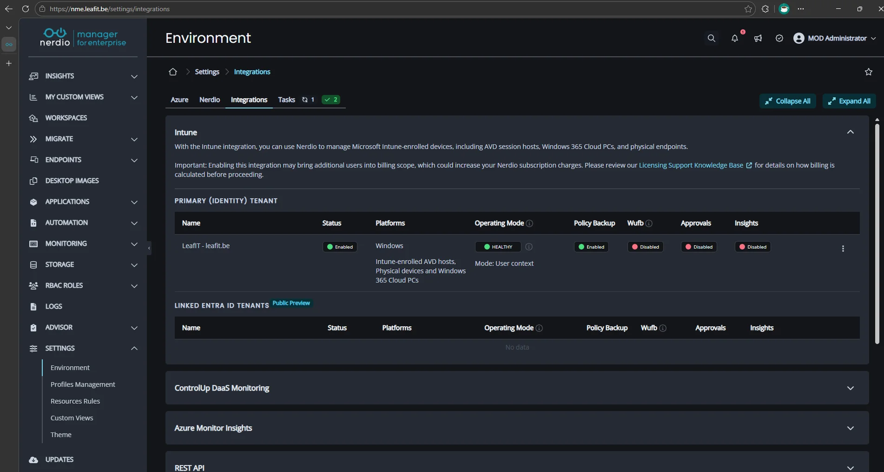
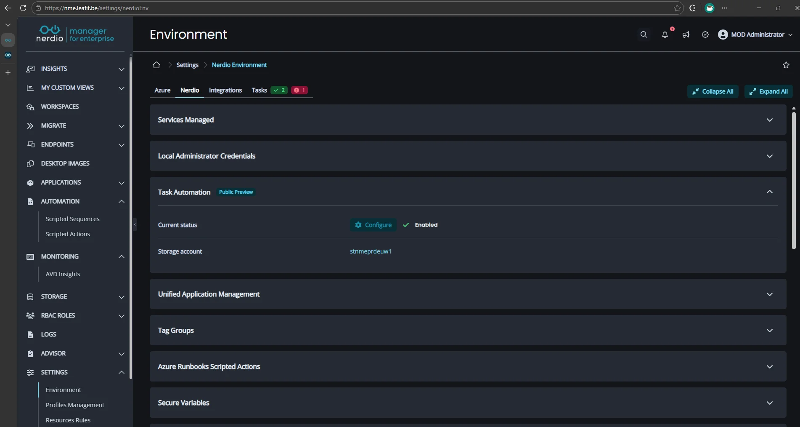
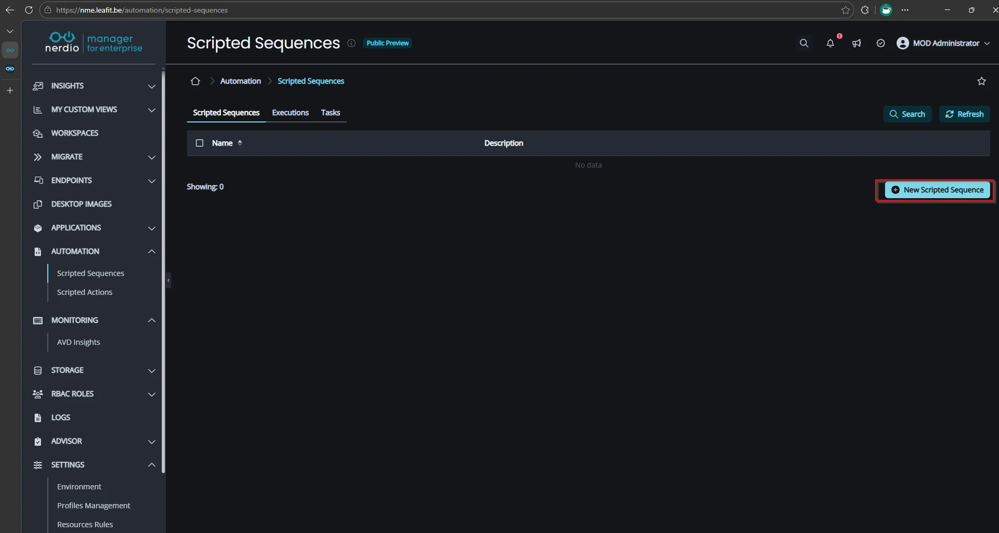
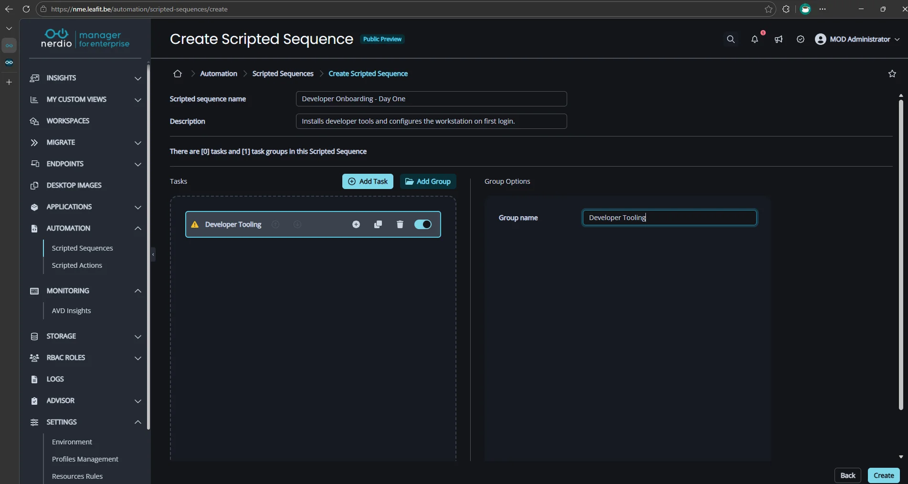
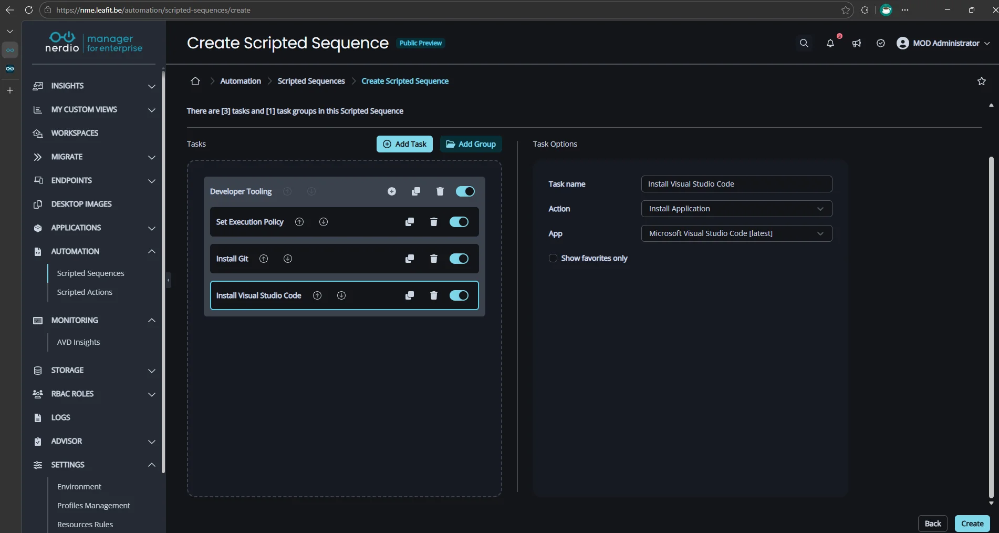
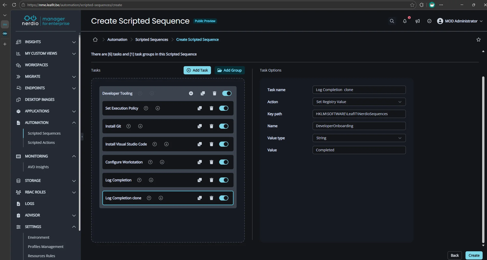
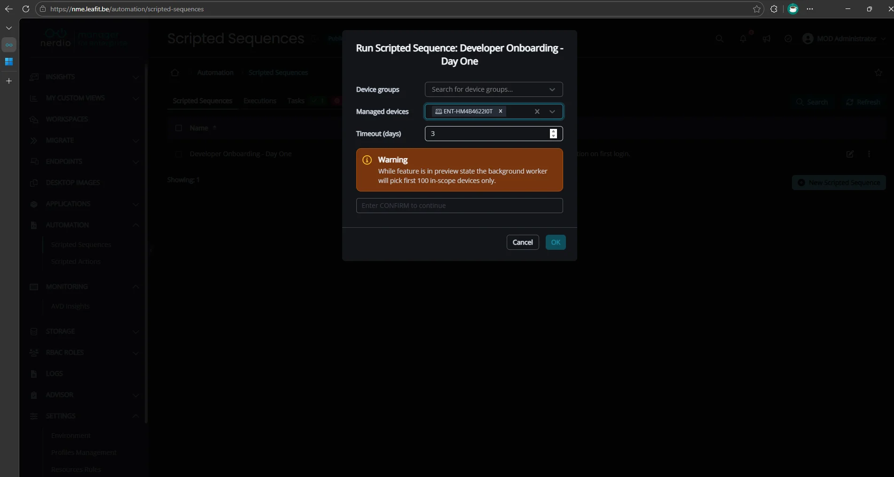
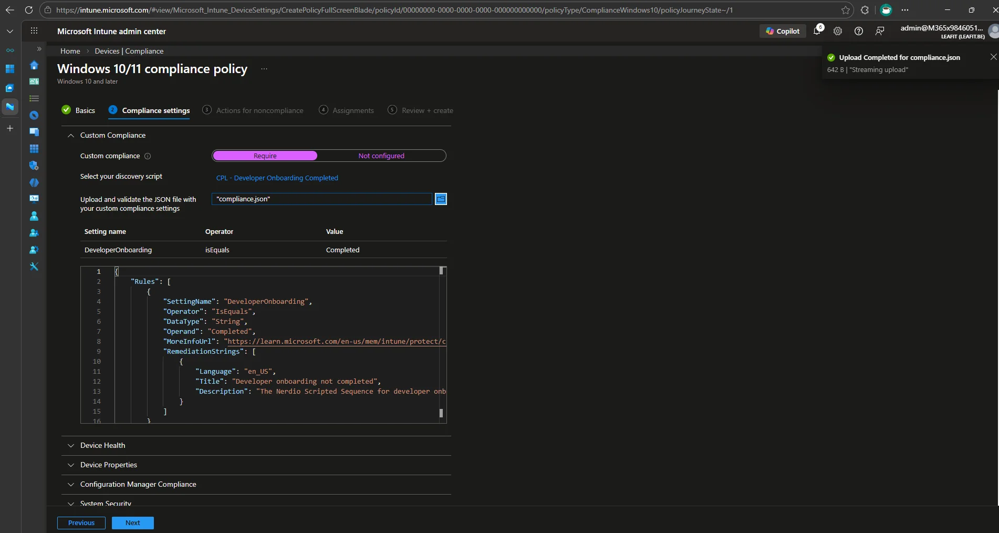

## Introduction

Setting up a new device for a developer usually means installing tools, cloning repositories, and applying configurations, **all in a specific order**. [Microsoft Intune](https://learn.microsoft.com/en-us/intune/intune-service/fundamentals/what-is-intune) handles app and script deployment well, but it does not guarantee execution order. A Git install that finishes after the script that clones your repos is a problem.

**Nerdio Scripted Sequences** solve this. Introduced in [Nerdio Manager for Enterprise](https://getnerdio.com/) (NME), Scripted Sequences let you define complex, multi-step task workflows with a guaranteed order of operations. They target Intune-managed devices, including [Windows 365](https://learn.microsoft.com/en-us/windows-365/overview) Cloud PCs, and execute tasks sequentially through the Nerdio Endpoint Worker.

In this post we will build a real-world **developer workstation onboarding sequence** that installs Git, Visual Studio Code, clones team repositories, and confirms completion, all in the right order, every time.

> **Note:** Scripted Sequences are in Public Preview. Feature scope and limitations may change in future NME releases.

## What Are Scripted Sequences?

Scripted Sequences are an automation feature in NME that lets you create multi-step task workflows deployed to Intune-managed devices. Think of them as a lightweight task sequencer built into the Nerdio console.

Key characteristics:

| Aspect | Detail |
|---|---|
| **Supported targets** | Intune-managed devices, including Windows 365 Cloud PCs |
| **Execution engine** | Nerdio Endpoint Worker (deployed via Intune platform script) |
| **Concurrency limit** | 100 concurrent tasks per sequence |
| **Task types** | PowerShell scripts, Winget installs, and other Intune-deliverable actions |

Sequences respect the defined order of operations: Task 2 will not start until Task 1 completes successfully. Tasks can be grouped into **Task Groups** for logical organization. You can **clone** sequences, groups, and individual tasks for faster iteration.

## Prerequisites

Before building your first sequence, make sure you have:

| Requirement | Detail |
|---|---|
| **Intune integration** | Enabled in NME under **Settings > Environment > Integrations > Intune** |
| **Target device** | A Windows 365 Cloud PC or Intune-managed Windows device |
| **Nerdio Endpoint Worker** | Deployed to the target device (covered in Step 1) |
| **Permissions** | NME admin role with access to the Automation module |

## The Demo Scenario

We will automate day-one setup for a developer joining the team. The sequence installs prerequisites first, then tools, then runs a configuration script, in that exact order.

| Order | Task | Purpose |
|---|---|---|
| 1 | Set PowerShell Execution Policy | Allow scripts to run (RemoteSigned) |
| 2 | Install Git | Version control tooling |
| 3 | Install Visual Studio Code | Code editor |
| 4 | Clone repos and configure VS Code | Pull team repos and install extensions |
| 5a | Add registry key | Create the completion marker key |
| 5b | Set registry value | Confirm the sequence finished |

Let's build it.

## Step 1: Enable the Intune Integration

Before you can use Scripted Sequences, the Intune integration must be enabled. This is where NME connects to your Intune tenant.

1. Navigate to **NME** > **Settings** > **Environment** > **Integrations** > **Intune**.
2. Ensure the Intune integration is enabled.

> **Note:** The initial Endpoint Worker deployment is controlled by Intune platform script delivery and may take some time. Subsequent tasks to the same device execute within a 15 to 30 minute window.



## Step 2: Configure Task Automation

Task Automation must be configured before you can create or run Scripted Sequences.

1. Navigate to **NME** > **Settings** > **Nerdio Environment** > **Task Automation**.
2. Click **Configure**.
3. Enter a name and select a resource group for the Azure storage account that Nerdio Manager will create.
4. Click **Save** to complete the configuration.

> **Warning:** If your NME deployment uses the **Enable Private Endpoints** scripted action, the storage account created here may have public network access disabled by default. The Nerdio Endpoint Worker on target devices needs to reach this storage account, so verify that public access is enabled or that a private endpoint is configured for it.



## Step 3: Create the Scripted Sequence

1. Navigate to **NME** > **Automation** > **Scripted Sequences**.
2. Click **New Scripted Sequence**.
3. Name the sequence `Developer Onboarding - Day One`.
4. Optionally add a description: *Installs developer tools and configures the workstation on first login.*



## Step 4: Add a Task Group

Task Groups let you organize related tasks. We will create one group for this sequence.

1. Inside the sequence, click **Add task or Add group**.
2. Select **Add group**.
3. Name the group `Developer Tooling`.

> **Note:** A group must contain at least one task.



## Step 5: Define the Tasks

Add the following six tasks inside the **Developer Tooling** group. The order you add them is the order they will execute.

### Task 1: Set PowerShell Execution Policy

This ensures all subsequent PowerShell-based tasks can run.

- **Task name:** `Set Execution Policy`
- **Type:** PowerShell script
- **Script:**

```powershell
Set-ExecutionPolicy -ExecutionPolicy RemoteSigned -Scope LocalMachine -Force
```

### Task 2: Install Git

This task uses a PowerShell script to install Git via winget. You could also use the **Install Application** task type instead.

- **Task name:** `Install Git`
- **Type:** PowerShell script
- **Script:**

```powershell
winget install --id Git.Git --accept-source-agreements --accept-package-agreements --silent
```

### Task 3: Install Visual Studio Code

This task uses the **Install Application** task type, which lets you select a winget package directly without writing a script. You could also use a PowerShell script as shown in Task 2.

- **Task name:** `Install Visual Studio Code`
- **Type:** Install Application
- **Winget package ID:** `Microsoft.VisualStudioCode`



### Task 4: Clone Repos and Configure VS Code

This script clones the team repository and installs essential VS Code extensions. Adjust the repository URL and extension list to match your environment.

- **Task name:** `Configure Workstation`
- **Type:** PowerShell script
- **Script:**

```powershell
# Refresh PATH so git and code are available
$env:Path = [System.Environment]::GetEnvironmentVariable("Path", "Machine") + ";" + [System.Environment]::GetEnvironmentVariable("Path", "User")

# Clone team repository
$repoPath = "$env:USERPROFILE\Source\Repos"
New-Item -ItemType Directory -Path $repoPath -Force | Out-Null
git clone https://dev.azure.com/contoso/project/_git/main-repo "$repoPath\main-repo"

# Install VS Code extensions
code --install-extension ms-vscode.powershell
code --install-extension ms-python.python
code --install-extension hashicorp.terraform
```

### Task 5a: Add Registry Key

First, create the registry key that will hold the completion marker.

- **Task name:** `Log Completion`
- **Action:** Add Registry Key
- **Key path:** `HKLM\SOFTWARE\LeafIT\NerdioSequences`

### Task 5b: Set Registry Value

Next, set a value under the key to confirm the sequence completed. This makes it easy to query device status remotely via Intune or PowerShell.

- **Task name:** `Log Completion clone`
- **Action:** Set Registry Value
- **Key path:** `HKLM\SOFTWARE\LeafIT\NerdioSequences`
- **Name:** `DeveloperOnboarding`
- **Value type:** String
- **Value:** `Completed`



## Step 6: Clone Tasks for Quick Iteration

Need a second sequence for designers with different tools? Since NME v7.6.0, you can **clone** the entire sequence or individual task groups and tasks.

1. On the **Scripted Sequences** page, select the `Developer Onboarding - Day One` sequence.
2. Click **Clone**.
3. Rename the cloned sequence and swap Git/VS Code for the tools your designers need.

This saves significant time compared to rebuilding sequences from scratch.

## Step 7: Target Devices and Execute

1. On the **Scripted Sequences** page, click the three dots to the right of the `Developer Onboarding - Day One` sequence.
2. Click **Run now**.
3. Select the target Windows 365 Cloud PC or Intune device.

NME will push the tasks to the Nerdio Endpoint Worker on the device. Each task runs in order. Task 2 only starts after Task 1 reports success.



> **Tip:** Monitor progress in **NME** > **Logs**.

## Step 8: Validate on the Device

Log into the target Cloud PC and verify:

1. **Git** is installed. Open a terminal and run `git --version`.
2. **VS Code** is installed. Launch it from the Start menu.
3. **Repos** are cloned. Check `%USERPROFILE%\Source\Repos\main-repo`.
4. **Extensions** are present. Open VS Code and navigate to the Extensions panel.
5. **Registry key** exists. Open a terminal and run `reg query "HKLM\SOFTWARE\LeafIT\NerdioSequences" /v DeveloperOnboarding`.

## Bonus: Compliance Script for Onboarding Verification

Since the sequence writes a registry value on completion, you can create an Intune custom compliance policy to verify that a device has finished the onboarding sequence. Devices that have not completed it will be marked as non-compliant.

### Detection Script

Create a PowerShell detection script that checks for the registry value:

```powershell
$result = @{ DeveloperOnboarding = "NotCompleted" }

try {
    $value = Get-ItemPropertyValue -Path "HKLM:\SOFTWARE\LeafIT\NerdioSequences" -Name "DeveloperOnboarding" -ErrorAction Stop
    if ($value -eq "Completed") {
        $result.DeveloperOnboarding = "Completed"
    }
} catch {}

$result | ConvertTo-Json -Compress
exit 0
```

### Compliance JSON

Upload the following JSON as the compliance rules definition:

```json
{
    "Rules": [
        {
            "SettingName": "DeveloperOnboarding",
            "Operator": "IsEquals",
            "DataType": "String",
            "Operand": "Completed",
            "MoreInfoUrl": "https://learn.microsoft.com/en-us/mem/intune/protect/compliance-custom-json",
            "RemediationStrings": [
                {
                    "Language": "en_US",
                    "Title": "Developer onboarding not completed",
                    "Description": "The Nerdio Scripted Sequence for developer onboarding has not completed on this device."
                }
            ]
        }
    ]
}
```

### Deploying the Policy

1. Navigate to **Microsoft Intune** > **Devices** > **Compliance** > **Create policy**.
2. Select **Windows 10/11** as the platform.
3. Under **Profile type**, select **Windows 10/11 compliance policy** from the **Templates** section.
4. Enter a name and description for the policy:
   - **Name:** `CPL - Developer Onboarding Completed`
   - **Description:** `Verifies that the Nerdio Scripted Sequence for developer onboarding has completed by checking the registry key.`
5. Open the **Custom Compliance** blade.
6. Upload the detection script.
7. Upload the compliance JSON.
8. Assign the policy to the same device group targeted by the Scripted Sequence.



Devices that have completed the sequence will report as compliant. Devices that have not will show the custom non-compliance message, giving you a clear overview of onboarding status across your fleet.

## Current Limitations

Scripted Sequences are still in Public Preview. Keep these constraints in mind:

| Limitation | Detail |
|---|---|
| **Concurrency** | Maximum 100 concurrent tasks per sequence |
| **Device scope** | Intune-managed devices only (AVD support planned for a future release) |
| **Targeting** | Manual device selection required; automated assignment to new devices is planned |
| **Initial deployment** | The Endpoint Worker relies on Intune platform script delivery, which can take time on first deploy |
| **Cross-tenant** | Running sequences against secondary tenant Windows 365 devices is not yet supported |

## Conclusion

**Nerdio Scripted Sequences** bring deterministic, ordered task execution to Intune-managed devices. This is something native Intune cannot guarantee today. By combining simple PowerShell scripts in a defined sequence, you can automate complex onboarding workflows and ensure every new device is configured consistently.

As the feature moves toward general availability, expect expanded scope and deeper integration within NME. For now, it is already a practical tool for any organization managing Intune endpoints at scale.